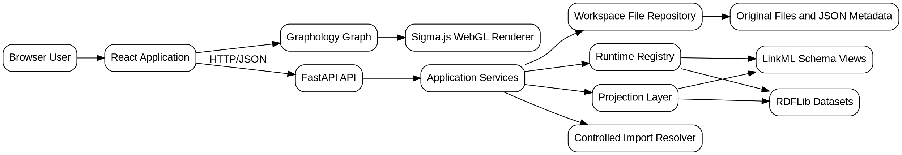
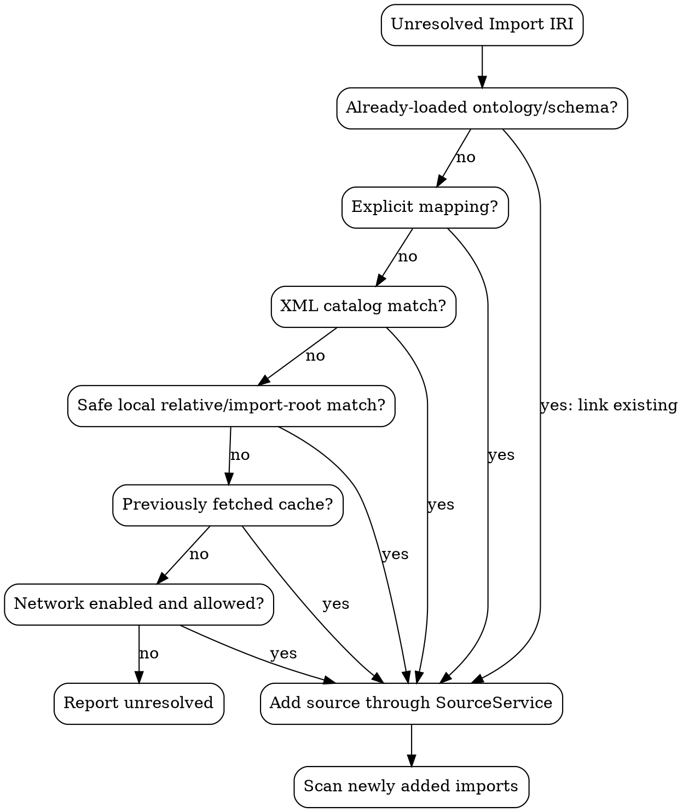

# Detailed Implementation Plan: Multi-Ontology OWL/RDF/LinkML Viewer

**Prepared:** September 17, 2026  
**Target implementer:** Junior engineer with basic Python, JavaScript/TypeScript, HTTP, and data-structure knowledge  
**Recommended implementation:** Python/FastAPI backend with a React/TypeScript/Sigma.js frontend

---

## 1. Executive summary

Build a browser-based application that:

1. Accepts one or more RDF, OWL, or LinkML files.
2. Preserves each original file and its provenance.
3. Parses RDF/OWL into RDF datasets.
4. Parses LinkML into native LinkML schema objects.
5. Converts both models into a shared visualization graph.
6. Merges nodes representing the same IRI.
7. Records which source documents and logical ontologies:
   - Declare each node.
   - Reference each node.
   - Assert each relationship.
8. Supports four views:
   - Raw RDF graph.
   - OWL semantic graph.
   - LinkML schema graph.
   - Ontology overview graph.
9. Uses WebGL rather than DOM or SVG elements for individual nodes.
10. Applies filtering and level-of-detail rules so thousands of entities remain usable.

RDF is fundamentally a graph of triples, while RDF datasets add named graphs. OWL can be mapped into RDF triples, including blank-node structures and RDF lists for anonymous expressions. That is why the application must preserve a raw RDF representation even when it also builds a friendlier OWL semantic projection. ([w3.org](https://www.w3.org/TR/rdf11-concepts/))

LinkML has its own schema model based on classes, slots, types, enums, prefixes, inheritance, and imports. It should be parsed natively rather than used as a mandatory intermediate representation for OWL. ([linkml.io](https://linkml.io/linkml-model/latest/docs/))

The Common Core Ontologies should be treated as a modular set of OWL sources with import relationships, not as one hard-coded file. The application should use the official repository as a compatibility target and support its local catalog/import arrangement without embedding a fixed list of modules. ([github.com](https://github.com/CommonCoreOntology/CommonCoreOntologies))

RDFLib and LinkML Runtime are appropriate Python-side parsing tools. FastAPI provides the upload/API layer, while Graphology and Sigma.js provide the client-side graph data structure and WebGL renderer. ([rdflib.readthedocs.io](https://rdflib.readthedocs.io/en/stable/))

---

# 2. Important scope boundaries

The phrase “arbitrary OWL/RDF” needs a precise engineering definition.

## 2.1 Formats supported in version 1

| Input | Version 1 support |
|---|---|
| RDF/XML | Yes |
| Turtle | Yes |
| N-Triples | Yes |
| N-Quads | Yes |
| TriG | Yes |
| JSON-LD with local contexts | Yes |
| JSON-LD requiring remote contexts | Rejected by default |
| OWL encoded as RDF/XML | Yes |
| OWL encoded as Turtle | Yes |
| OWL encoded in other supported RDF formats | Yes |
| LinkML YAML | Yes |
| LinkML JSON | Yes |
| OWL Functional Syntax | No; future adapter |
| Manchester OWL Syntax | No; future adapter |
| OBO format | No; future adapter |
| RDF-star | Not guaranteed in version 1 |

## 2.2 Meaning of “raw”

“Raw RDF view” means the application displays the parsed RDF statements, including:

- Subjects.
- Predicates.
- Objects.
- Blank nodes.
- Literals.
- Datatypes.
- Language tags.
- Named-graph identifiers.
- Source-document provenance.

It does **not** mean preserving the visual order or whitespace of the original Turtle or RDF/XML file. RDF is graph-based, and source-order differences are not semantically meaningful.

The original uploaded bytes will nevertheless be saved exactly and made downloadable.

## 2.3 Semantic limitations in version 1

Version 1 will recognize common OWL structures, but it will not pretend to implement a complete OWL reasoner.

Version 1 will support semantic visualization of:

- Classes.
- Named individuals.
- Object properties.
- Data properties.
- Annotation properties.
- Subclass relationships.
- Class assertions.
- Equivalent classes.
- Disjoint classes.
- Domain and range.
- Inverse properties.
- Imports.
- Common property restrictions.
- RDF-list-based class expressions where practical.

Version 1 will not:

- Run a complete OWL DL reasoner.
- Calculate a complete inferred class hierarchy.
- Validate logical consistency.
- Guarantee semantic simplification of every possible OWL axiom.
- Convert arbitrary OWL into LinkML without information loss.

Any unrecognized OWL structure remains visible in raw RDF mode.

## 2.4 Operational limitations in version 1

- Run one backend application process.
- Use local disk for workspace metadata and original files.
- Keep parsed RDF and LinkML objects in memory while a workspace is active.
- Reparse saved files lazily after a restart.
- Disable remote import fetching by default.
- Set configurable node, edge, upload, and import limits.
- Do not expose unrestricted SPARQL in version 1.

These choices keep the first implementation understandable to a junior engineer.

---

# 3. Architectural decisions

## 3.1 Selected stack

| Layer | Technology |
|---|---|
| Backend language | Python |
| Web API | FastAPI |
| RDF parsing | RDFLib |
| LinkML parsing | LinkML Runtime |
| Metadata persistence | JSON files on local disk |
| Runtime graph storage | In-memory RDFLib datasets and LinkML objects |
| Frontend language | TypeScript |
| UI | React |
| Build system | Vite |
| Client graph structure | Graphology |
| Graph renderer | Sigma.js |
| UI state | Zustand |
| Frontend tests | Vitest and React Testing Library |
| End-to-end tests | Playwright |
| Backend tests | pytest |
| Container deployment | Docker Compose |

## 3.2 Why LinkML is not the shared canonical format

Do not convert every RDF or OWL source into LinkML before rendering.

That would lose or distort constructs such as:

- Anonymous OWL restrictions.
- Arbitrary RDF predicates.
- RDF named graphs.
- RDF lists.
- OWL property chains.
- Axiom annotations.
- Punning.
- Blank-node structures.
- Arbitrary RDF data not shaped as a schema.

Instead:

- RDF/OWL remains an RDF dataset.
- LinkML remains a LinkML schema.
- Both are projected into a shared **visual graph model**.

## 3.3 System architecture



---

# 4. Core terminology

Use these terms consistently in code and documentation.

| Term | Meaning |
|---|---|
| Workspace | A user-created container holding one or more uploaded sources |
| Source | One uploaded or imported document |
| Ontology | A logical ontology identified by an ontology IRI |
| Source ID | Application-generated identifier for a document |
| Ontology ID | Application-generated identifier for a logical ontology |
| Entity | An IRI, blank node, literal, or LinkML schema element |
| Declaration | A statement saying what an entity is, such as `owl:Class` |
| Reference | Use of an entity without declaring it |
| Assertion | A relationship or statement contributed by a source |
| Projection | Transformation from RDF or LinkML into visualization nodes and edges |
| Evidence | Original RDF statement or LinkML path supporting a visual element |
| Cross-ontology edge | An assertion connecting entities declared by different ontologies |
| Profile | Display and import defaults for a family such as CCO |

---

# 5. Provenance rules

Provenance is a primary requirement, not an optional annotation.

## 5.1 Source identity

Each source gets:

- A UUID.
- Original file name.
- Stored file name.
- MIME type.
- Detected format.
- SHA-256 checksum.
- File size.
- User-visible color.
- Parse status.
- Parse warnings.
- Declared ontology information.
- Import declarations.
- Prefix bindings.
- Upload or import origin.

## 5.2 Logical ontology identity

A source can declare:

- No ontology.
- One ontology.
- Multiple ontologies.

Each logical ontology descriptor contains:

- Application ontology ID.
- Ontology IRI.
- Version IRI.
- Display name.
- Source ID.
- Named-graph identifier, when relevant.
- Import IRIs.
- Color.

If a source declares one ontology, the source and ontology can share a color.

If a source declares multiple ontologies, allocate separate ontology colors and retain the source color for document-level views.

## 5.3 Shared IRI behavior

When two sources reference the same IRI:

1. Create one visual node.
2. Merge its source memberships.
3. Preserve every declaration and reference.
4. Choose one display label using deterministic label rules.
5. Store all alternative labels.
6. Mark the node as multi-source or multi-ontology.
7. Show all contributing sources in the details panel.

Do not create duplicate nodes merely because the same IRI appears in several files.

## 5.4 Blank-node behavior

Blank nodes are local to a source dataset.

Their visual IDs must include the source ID, preventing two unrelated blank nodes from being merged.

Blank-node identifiers do not need to remain stable across a complete backend reparse. The application must not promise permanent URLs for blank nodes.

## 5.5 Literal behavior

Two identical literals may share a visual node when they have the same:

- Lexical value.
- Datatype.
- Language tag.

Their evidence still records all asserting sources.

## 5.6 Relationship provenance

Every visual edge records:

- Asserting source IDs.
- Asserting ontology IDs when known.
- Predicate IRI.
- Statement evidence.
- Named graph.
- Whether it is asserted or generated by projection.
- Whether it crosses ontology boundaries.

---

# 6. Shared visual graph model

The backend must return one graph contract regardless of whether the source was RDF, OWL, or LinkML.

## 6.1 Node model

A visual node should have these fields:

```python
class GraphNode(BaseModel):
    id: str
    term_kind: TermKind
    primary_kind: NodeKind
    kinds: list[NodeKind]

    iri: str | None
    compact_iri: str | None
    label: str
    labels: list[LabelValue]

    source_ids: list[str]
    ontology_ids: list[str]
    declared_in_source_ids: list[str]
    declared_in_ontology_ids: list[str]
    referenced_by_source_ids: list[str]

    evidence: list[EvidenceRef]
    evidence_count: int

    attributes: dict[str, Any]
```

`kinds` must be a list because OWL permits the same IRI to participate in more than one role.

## 6.2 Edge model

```python
class GraphEdge(BaseModel):
    id: str
    source: str
    target: str

    kind: EdgeKind
    predicate_iri: str | None
    label: str

    source_ids: list[str]
    ontology_ids: list[str]

    evidence: list[EvidenceRef]
    evidence_count: int

    asserted: bool
    inferred: bool
    cross_ontology: bool

    attributes: dict[str, Any]
```

Version 1 normally sets:

- `asserted` to `true`.
- `inferred` to `false`.

Projection-created helper relationships, such as a LinkML class-to-slot edge, can have `asserted=false` while still pointing to the LinkML definition that generated them.

## 6.3 Evidence model

```python
class EvidenceRef(BaseModel):
    source_id: str
    ontology_id: str | None
    graph_name: str | None

    statement_id: str | None
    linkml_path: str | None

    subject: str | None
    predicate: str | None
    object: str | None
```

Limit evidence included in graph responses to a configurable number, such as 20 entries. Return the full evidence count and use the entity-details endpoint for complete pagination.

---

# 7. API contract

All version 1 endpoints use the `/api/v1` prefix.

## 7.1 Health and capabilities

| Method | Endpoint | Purpose |
|---|---|---|
| `GET` | `/healthz` | Process health |
| `GET` | `/readyz` | Data-directory and service readiness |
| `GET` | `/capabilities` | Supported formats and configured limits |

## 7.2 Workspaces

| Method | Endpoint | Purpose |
|---|---|---|
| `POST` | `/workspaces` | Create workspace |
| `GET` | `/workspaces` | List workspaces |
| `GET` | `/workspaces/{workspace_id}` | Get workspace |
| `PATCH` | `/workspaces/{workspace_id}` | Rename workspace |
| `DELETE` | `/workspaces/{workspace_id}` | Delete workspace and files |

## 7.3 Sources

| Method | Endpoint | Purpose |
|---|---|---|
| `POST` | `/workspaces/{id}/sources` | Upload one or more files |
| `GET` | `/workspaces/{id}/sources` | List sources |
| `GET` | `/workspaces/{id}/sources/{source_id}` | Get source metadata |
| `GET` | `/workspaces/{id}/sources/{source_id}/raw` | Download original file |
| `DELETE` | `/workspaces/{id}/sources/{source_id}` | Delete source |

Upload behavior:

- Use multipart form data.
- Accept repeated `files` fields.
- Process each file independently.
- Return success or error for every file.
- Do not discard successful files because another file failed.

## 7.4 Imports

| Method | Endpoint | Purpose |
|---|---|---|
| `POST` | `/workspaces/{id}/imports/scan` | Find unresolved imports |
| `POST` | `/workspaces/{id}/imports/resolve` | Resolve imports |
| `GET` | `/workspaces/{id}/imports` | Return import graph/status |

## 7.5 Graphs

| Method | Endpoint | Purpose |
|---|---|---|
| `POST` | `/workspaces/{id}/graph/query` | Build a filtered projection |

Example request:

```json
{
  "view": "owl",
  "source_ids": [],
  "ontology_ids": [],
  "root_node_id": null,
  "depth": 2,
  "include_annotations": false,
  "include_literals": false,
  "include_blank_nodes": true,
  "include_imports": true,
  "include_unhandled_axioms": false,
  "node_kinds": [],
  "edge_kinds": [],
  "cross_ontology_only": false,
  "text_filter": null,
  "max_nodes": 5000,
  "max_edges": 20000,
  "profile": "generic"
}
```

## 7.6 Entity details

| Method | Endpoint | Purpose |
|---|---|---|
| `GET` | `/workspaces/{id}/entities/{node_id}` | Entity metadata and provenance |
| `GET` | `/workspaces/{id}/entities/{node_id}/statements` | Paginated incoming/outgoing statements |

---

# 8. Repository structure

The following is the complete version 1 repository plan.

```text
ontology-viewer/
├── README.md
├── CONTRIBUTING.md
├── SECURITY.md
├── .gitignore
├── .editorconfig
├── .env.example
├── .pre-commit-config.yaml
├── Makefile
├── docker-compose.yml
├── .github/
│   └── workflows/
│       └── ci.yml
├── docs/
│   ├── architecture.md
│   ├── domain-model.md
│   ├── api.md
│   ├── import-resolution.md
│   ├── cco-profile.md
│   ├── performance.md
│   └── test-plan.md
├── scripts/
│   ├── generate_large_fixture.py
│   └── cco_smoke_test.py
├── backend/
│   ├── pyproject.toml
│   ├── requirements.lock
│   ├── Dockerfile
│   ├── app/
│   │   ├── __init__.py
│   │   ├── main.py
│   │   ├── config.py
│   │   ├── logging_config.py
│   │   ├── errors.py
│   │   ├── dependencies.py
│   │   ├── api/
│   │   │   ├── __init__.py
│   │   │   ├── router.py
│   │   │   ├── health.py
│   │   │   ├── workspaces.py
│   │   │   ├── sources.py
│   │   │   ├── imports.py
│   │   │   ├── graphs.py
│   │   │   └── entities.py
│   │   ├── models/
│   │   │   ├── __init__.py
│   │   │   ├── enums.py
│   │   │   ├── workspace.py
│   │   │   ├── source.py
│   │   │   ├── graph.py
│   │   │   ├── entity.py
│   │   │   └── imports.py
│   │   ├── ingestion/
│   │   │   ├── __init__.py
│   │   │   ├── detector.py
│   │   │   ├── rdf_loader.py
│   │   │   ├── linkml_loader.py
│   │   │   ├── metadata.py
│   │   │   ├── xml_catalog.py
│   │   │   └── safe_fetch.py
│   │   ├── projection/
│   │   │   ├── __init__.py
│   │   │   ├── ids.py
│   │   │   ├── labels.py
│   │   │   ├── builder.py
│   │   │   ├── raw.py
│   │   │   ├── owl.py
│   │   │   ├── linkml.py
│   │   │   ├── overview.py
│   │   │   └── filters.py
│   │   ├── profiles/
│   │   │   ├── __init__.py
│   │   │   ├── base.py
│   │   │   ├── cco.py
│   │   │   └── data/
│   │   │       └── cco.yaml
│   │   ├── storage/
│   │   │   ├── __init__.py
│   │   │   ├── workspace_repo.py
│   │   │   ├── runtime.py
│   │   │   └── cache.py
│   │   ├── services/
│   │   │   ├── __init__.py
│   │   │   ├── workspace_service.py
│   │   │   ├── source_service.py
│   │   │   ├── import_service.py
│   │   │   ├── graph_service.py
│   │   │   └── entity_service.py
│   │   └── utils/
│   │       ├── __init__.py
│   │       ├── atomic.py
│   │       ├── colors.py
│   │       ├── hashing.py
│   │       └── paths.py
│   └── tests/
│       ├── conftest.py
│       ├── test_detector.py
│       ├── test_rdf_loader.py
│       ├── test_linkml_loader.py
│       ├── test_metadata.py
│       ├── test_xml_catalog.py
│       ├── test_builder.py
│       ├── test_raw_projection.py
│       ├── test_owl_projection.py
│       ├── test_linkml_projection.py
│       ├── test_overview_projection.py
│       ├── test_source_service.py
│       ├── test_import_service.py
│       ├── test_graph_service.py
│       ├── test_api.py
│       ├── test_cco_smoke.py
│       └── fixtures/
│           ├── simple.ttl
│           ├── restriction.ttl
│           ├── named-graphs.trig
│           ├── linkml-schema.yaml
│           ├── ontology-a.ttl
│           ├── ontology-b.ttl
│           ├── import-root.ttl
│           ├── import-child.ttl
│           ├── catalog-v001.xml
│           ├── unsafe-doctype.rdf
│           └── remote-context.jsonld
└── frontend/
    ├── package.json
    ├── package-lock.json
    ├── tsconfig.json
    ├── vite.config.ts
    ├── eslint.config.js
    ├── index.html
    ├── Dockerfile
    ├── nginx.conf
    ├── playwright.config.ts
    ├── src/
    │   ├── vite-env.d.ts
    │   ├── main.tsx
    │   ├── App.tsx
    │   ├── api/
    │   │   ├── types.ts
    │   │   └── client.ts
    │   ├── state/
    │   │   ├── appStore.ts
    │   │   └── selectors.ts
    │   ├── hooks/
    │   │   ├── useWorkspace.ts
    │   │   └── useGraphQuery.ts
    │   ├── graph/
    │   │   ├── createGraph.ts
    │   │   ├── graphStyles.ts
    │   │   ├── sigmaSettings.ts
    │   │   ├── layouts.ts
    │   │   └── layout.worker.ts
    │   ├── components/
    │   │   ├── AppShell.tsx
    │   │   ├── Header.tsx
    │   │   ├── SourcePanel.tsx
    │   │   ├── UploadDialog.tsx
    │   │   ├── ImportDialog.tsx
    │   │   ├── GraphToolbar.tsx
    │   │   ├── GraphCanvas.tsx
    │   │   ├── Legend.tsx
    │   │   ├── DetailsPanel.tsx
    │   │   ├── RawTriplesTable.tsx
    │   │   ├── Feedback.tsx
    │   │   └── StatusBar.tsx
    │   ├── utils/
    │   │   └── format.ts
    │   ├── styles/
    │   │   └── global.css
    │   └── test/
    │       └── setup.ts
    ├── tests/
    │   ├── createGraph.test.ts
    │   ├── graphStyles.test.ts
    │   ├── appStore.test.ts
    │   ├── UploadDialog.test.tsx
    │   └── DetailsPanel.test.tsx
    └── e2e/
        ├── upload-and-render.spec.ts
        ├── multi-ontology.spec.ts
        └── large-graph.spec.ts
```

---

# 9. How to read the file plans

For each file, the numbered items below are the intended **top-to-bottom implementation order**.

Exact line numbers are deliberately not fixed because formatter output and import lengths will shift them. A junior engineer should implement each numbered item in order.

---

# 10. Root-file implementation plans

## 10.1 `README.md`

1. Add the project title.
2. Add a one-paragraph problem statement.
3. Add a feature list.
4. Add the supported-format table.
5. Add the explicit limitations from Section 2.
6. Add a screenshot placeholder.
7. Add a “Quick start with Docker” section.
8. Add a “Local development” section.
9. Add backend setup commands.
10. Add frontend setup commands.
11. Add common `make` commands.
12. Add a short architecture summary.
13. Link to every file in `docs/`.
14. Add security warnings about network imports.
15. Add test instructions.
16. Add the CCO smoke-test instructions.
17. Add licensing information.

**Done when:** A new developer can clone the repository and run both applications without asking for undocumented steps.

## 10.2 `CONTRIBUTING.md`

1. State required Python and Node versions.
2. Explain branch naming.
3. Explain environment setup.
4. Require small pull requests.
5. Require tests for new behavior.
6. Explain Python formatting, linting, and typing.
7. Explain TypeScript formatting, linting, and tests.
8. Explain how fixture files should be kept small.
9. Forbid committing complete external ontology distributions.
10. Require security review for network-fetch changes.
11. Add a pull-request checklist.

## 10.3 `SECURITY.md`

1. Explain how to report vulnerabilities privately.
2. List the main threat areas:
   - Untrusted uploads.
   - XML entities.
   - Remote JSON-LD contexts.
   - SSRF through imports.
   - Path traversal.
   - Zip bombs if archives are added later.
   - Expensive graph queries.
3. State that network imports are disabled by default.
4. State that arbitrary `file://` imports are rejected.
5. State upload and graph limits.
6. Explain supported-release policy.
7. Explain that unrestricted SPARQL is not available.

## 10.4 `.gitignore`

Include entries for:

- Python bytecode.
- Python virtual environments.
- pytest caches.
- coverage output.
- mypy and Ruff caches.
- Node modules.
- frontend build output.
- Playwright reports.
- `.env`.
- application data directory.
- generated synthetic fixtures.
- IDE files.
- operating-system metadata.

Do not ignore example fixture files or lock files.

## 10.5 `.editorconfig`

1. Set UTF-8.
2. Set LF line endings.
3. Require a final newline.
4. Trim trailing whitespace.
5. Use four spaces for Python.
6. Use two spaces for JSON, YAML, CSS, and TypeScript.
7. Do not trim whitespace in Markdown because Markdown can use trailing spaces.

## 10.6 `.env.example`

Add documented values for:

- Environment name.
- Log level.
- Data directory.
- Allowed frontend origins.
- Maximum upload bytes.
- Maximum workspace bytes.
- Maximum source count.
- Maximum import depth.
- Maximum imported source count.
- Maximum graph nodes.
- Maximum graph edges.
- Evidence entries per graph element.
- Projection-cache size.
- Network import enabled flag.
- Network host allowlist.
- Network timeout.
- Network maximum bytes.
- Configured XML catalog paths.
- Configured local import roots.

Use safe defaults.

## 10.7 `.pre-commit-config.yaml`

1. Add whitespace and end-of-file checks.
2. Add YAML syntax checking.
3. Add large-file prevention.
4. Add Ruff linting.
5. Add Ruff formatting.
6. Do not run the full frontend build in pre-commit.
7. Document that full tests run in CI.

## 10.8 `Makefile`

Implement these targets:

| Target | Action |
|---|---|
| `help` | Print target descriptions |
| `install-backend` | Create/install backend environment |
| `install-frontend` | Run locked frontend install |
| `dev-backend` | Start FastAPI development server |
| `dev-frontend` | Start Vite |
| `test-backend` | Run pytest |
| `test-frontend` | Run Vitest |
| `test` | Run both |
| `lint-backend` | Run Ruff and mypy |
| `lint-frontend` | Run ESLint and TypeScript checking |
| `lint` | Run all lint checks |
| `format` | Format backend and frontend |
| `e2e` | Run Playwright |
| `docker-up` | Start Docker Compose |
| `docker-down` | Stop Docker Compose |
| `generate-large` | Run the synthetic fixture generator |
| `cco-smoke` | Run the CCO compatibility script |
| `clean` | Delete build and cache output, not user data |

Put `help` first and make it the default target.

## 10.9 `docker-compose.yml`

1. Define a backend service.
2. Build from `backend/Dockerfile`.
3. Mount a named data volume.
4. Pass backend settings through environment variables.
5. Expose the backend only to the frontend service unless development access is needed.
6. Define a frontend service.
7. Build from `frontend/Dockerfile`.
8. Map the public HTTP port.
9. Add a backend health check.
10. Make the frontend depend on backend readiness.
11. Do not enable multiple backend workers in version 1.

## 10.10 `.github/workflows/ci.yml`

Create jobs for:

1. Backend linting.
2. Backend type checking.
3. Backend unit tests with coverage.
4. Frontend locked installation.
5. Frontend linting.
6. Frontend type checking.
7. Frontend unit tests.
8. Frontend production build.
9. Docker image build.
10. Optional Playwright smoke test.

Do not download CCO from the internet during ordinary pull-request CI. Run the external CCO smoke test manually or on a controlled scheduled runner.

---

# 11. Documentation-file plans

## 11.1 `docs/architecture.md`

1. Restate the architecture diagram.
2. Explain why the backend and frontend are separate.
3. Explain the source-versus-ontology distinction.
4. Explain runtime storage.
5. Explain disk persistence.
6. Explain lazy reloading.
7. Explain projection caching.
8. Explain the one-process limitation.
9. Add a section for future Oxigraph migration.

## 11.2 `docs/domain-model.md`

1. Define workspace.
2. Define source.
3. Define logical ontology.
4. Define entity.
5. Define statement evidence.
6. Define visual node and edge.
7. Document shared-IRI merging.
8. Document blank-node scoping.
9. Document LinkML synthetic IRIs.
10. Document cross-ontology calculation.
11. Add small JSON examples.

## 11.3 `docs/api.md`

1. Document every endpoint.
2. Show request and response examples.
3. List error codes.
4. Explain multipart upload.
5. Explain graph-query limits.
6. Explain pagination.
7. Explain truncation warnings.
8. Explain source deletion behavior.
9. Point developers to FastAPI’s generated OpenAPI page.

## 11.4 `docs/import-resolution.md`

1. Explain `owl:imports`.
2. Explain LinkML imports.
3. List resolution order.
4. Explain loaded-source matching.
5. Explain XML catalog matching.
6. Explain local import roots.
7. Explain network import restrictions.
8. Explain recursion and cycle detection.
9. Explain maximum depth and source count.
10. Explain unresolved-import reporting.

## 11.5 `docs/cco-profile.md`

1. Explain that CCO parsing uses ordinary RDF/OWL parsing.
2. Explain what the CCO profile changes.
3. Explain local catalog setup.
4. Explain label preferences.
5. Explain hidden annotation defaults.
6. Explain external-import collapsing.
7. Explain how to run the smoke test.
8. Explain how to update namespace patterns after checking a new CCO release.
9. Forbid hard-coded assumptions about module file names.

## 11.6 `docs/performance.md`

1. Define target graph sizes.
2. Explain backend projection caching.
3. Explain response limits.
4. Explain frontend WebGL rendering.
5. Explain why individual nodes are not React components.
6. Explain layout workers.
7. Explain label suppression.
8. Explain graph truncation.
9. Explain benchmark procedure.
10. Include a results table to be filled in during implementation.

## 11.7 `docs/test-plan.md`

1. Describe unit tests.
2. Describe service integration tests.
3. Describe API tests.
4. Describe frontend unit tests.
5. Describe end-to-end tests.
6. Describe security tests.
7. Describe synthetic performance tests.
8. Describe the external CCO smoke test.
9. List release-blocking tests.

---

# 12. Script implementation plans

## 12.1 `scripts/generate_large_fixture.py`

### Purpose

Generate deterministic RDF datasets for performance testing.

### Top-to-bottom plan

1. Add a module docstring.
2. Import `argparse`, `random`, `pathlib`, and RDFLib terms.
3. Define command-line arguments:
   - Node count.
   - Edge count.
   - Source count.
   - Cross-source edge ratio.
   - Output directory.
   - Random seed.
4. Validate positive values.
5. Create deterministic source namespaces.
6. Divide classes among sources.
7. Emit one ontology declaration per source.
8. Emit class declarations and labels.
9. Emit a subclass backbone so the graph is connected.
10. Add random additional relationships.
11. Add relationships crossing source boundaries.
12. Serialize one Turtle file per source.
13. Print file names, statement counts, and checksum summaries.
14. Exit with nonzero status on write failure.

### Required outputs

The script must support generating at least:

- 1,000 nodes and 5,000 edges.
- 5,000 nodes and 25,000 edges.
- 10,000 nodes and 50,000 edges.

## 12.2 `scripts/cco_smoke_test.py`

1. Accept a path to a local CCO checkout or distribution.
2. Accept optional catalog paths.
3. Do not download content automatically.
4. Find candidate RDF/OWL files.
5. Create a temporary workspace.
6. Load all candidate source files.
7. Record parse successes and failures.
8. Resolve imports locally.
9. Build ontology overview.
10. Build OWL projection with conservative limits.
11. Count:
    - Sources.
    - Ontologies.
    - Classes.
    - Properties.
    - Imports.
    - Unresolved imports.
    - Cross-ontology references.
12. Print a JSON report.
13. Exit nonzero if:
    - Any source fails to parse.
    - Required imports remain unresolved.
    - No classes are found.
    - Projection crashes.
14. Delete the temporary workspace unless `--keep` is supplied.

---

# 13. Backend configuration files

## 13.1 `backend/pyproject.toml`

1. Add build-system configuration.
2. Add project metadata.
3. Set the supported Python range selected by the team.
4. Add runtime dependencies:
   - FastAPI.
   - Uvicorn.
   - Pydantic.
   - Pydantic Settings.
   - Python multipart handling.
   - RDFLib.
   - LinkML Runtime.
   - HTTPX.
   - DefusedXML.
   - PyYAML if directly used.
5. Add development dependencies:
   - pytest.
   - pytest-asyncio.
   - pytest-cov.
   - Ruff.
   - mypy.
   - HTTPX test support.
6. Configure Ruff.
7. Configure mypy.
8. Configure pytest.
9. Define `slow` and `external` pytest markers.
10. Use exact tested versions in `requirements.lock`.

Do not blindly copy package versions from this plan. Resolve compatible versions at implementation start and commit the lock file.

## 13.2 `backend/requirements.lock`

1. Generate it from the selected dependency set.
2. Pin every direct and transitive dependency.
3. Do not hand-edit it.
4. Regenerate it only in a dependency-update pull request.
5. Make CI install from this file.

## 13.3 `backend/Dockerfile`

1. Start from a pinned Python slim image.
2. Set Python environment flags.
3. Create a non-root user.
4. Copy dependency metadata.
5. Install locked dependencies.
6. Copy the application.
7. Create the data directory.
8. Change data-directory ownership.
9. Switch to the non-root user.
10. Expose port 8000.
11. Start one Uvicorn worker.
12. Add no development reload option.

---

# 14. Backend application-shell files

## 14.1 `backend/app/__init__.py`

1. Add a package docstring.
2. Define `__version__`.
3. Export nothing else.

## 14.2 `backend/app/config.py`

1. Add imports.
2. Define a `Settings` class using Pydantic Settings.
3. Add application identity fields.
4. Add environment and log-level fields.
5. Add `data_dir`.
6. Add allowed origins.
7. Add upload-size limits.
8. Add workspace-size limits.
9. Add source-count limits.
10. Add graph node and edge limits.
11. Add import depth and count limits.
12. Add evidence limits.
13. Add projection-cache limits.
14. Add network import controls.
15. Add catalog and import-root paths.
16. Add preferred label languages.
17. Add validators for positive numbers.
18. Add a validator that creates normalized absolute paths.
19. Define a cached `get_settings()` function.

Never read environment variables directly in unrelated files.

## 14.3 `backend/app/logging_config.py`

1. Define a function accepting log level and environment.
2. Build a Python logging dictionary.
3. Use readable logs in development.
4. Use structured or compact logs in production.
5. Reduce noisy library log levels.
6. Do not log source file contents.
7. Do not log authorization headers if authentication is added later.

## 14.4 `backend/app/errors.py`

Define these exceptions:

- `AppError`.
- `NotFoundError`.
- `ConflictError`.
- `InvalidSourceError`.
- `UnsupportedFormatError`.
- `ParseSourceError`.
- `LimitExceededError`.
- `ImportResolutionError`.
- `UnsafeRemoteResourceError`.

Each error should contain:

- Machine-readable code.
- Human-readable message.
- HTTP status.
- Optional details dictionary.

Also define FastAPI exception handlers returning:

```json
{
  "error": {
    "code": "source_parse_failed",
    "message": "The Turtle document could not be parsed.",
    "details": {}
  }
}
```

## 14.5 `backend/app/dependencies.py`

1. Define an `AppContainer` dataclass.
2. Give it fields for:
   - Settings.
   - Workspace repository.
   - Runtime registry.
   - Workspace service.
   - Source service.
   - Import service.
   - Graph service.
   - Entity service.
3. Define `build_container(settings)`.
4. Construct shared storage objects.
5. Construct services in dependency order.
6. Define `get_container(request)`.
7. Define convenience dependencies for each service.
8. Retrieve the container from `request.app.state`.
9. Raise a clear error if startup did not initialize it.

## 14.6 `backend/app/main.py`

1. Import FastAPI and middleware.
2. Import settings, logging, errors, dependencies, and API router.
3. Define an async lifespan function.
4. During startup:
   - Load settings.
   - Configure logging.
   - Create the data directory.
   - Build the application container.
   - Store it in `app.state`.
   - Verify repository writability.
5. During shutdown:
   - Clear runtime caches.
   - Close HTTP clients.
6. Construct the FastAPI application.
7. Configure title and version.
8. Add CORS middleware.
9. Add GZip middleware.
10. Register application exception handlers.
11. Include the versioned router.
12. Do not perform ontology parsing during module import.
13. Export `app`.

---

# 15. Backend API files

## 15.1 API `__init__.py`

Add only a package docstring.

## 15.2 `backend/app/api/router.py`

1. Create the `/api/v1` router.
2. Include health routes.
3. Include workspace routes.
4. Include source routes.
5. Include import routes.
6. Include graph routes.
7. Include entity routes.
8. Use tags so generated documentation is organized.

## 15.3 `backend/app/api/health.py`

Implement:

- `GET /healthz`.
- `GET /readyz`.
- `GET /capabilities`.

`/capabilities` returns:

- Supported RDF formats.
- Supported LinkML formats.
- Maximum upload bytes.
- Maximum graph nodes and edges.
- Whether network imports are enabled.
- Available profiles.
- Application version.

## 15.4 `backend/app/api/workspaces.py`

1. Define `POST /workspaces`.
2. Accept `WorkspaceCreate`.
3. Call `WorkspaceService.create`.
4. Define `GET /workspaces`.
5. Define `GET /workspaces/{id}`.
6. Define `PATCH /workspaces/{id}`.
7. Define `DELETE /workspaces/{id}`.
8. Validate UUIDs through model typing.
9. Return `404` for missing workspaces.
10. Return `204` after successful deletion.

## 15.5 `backend/app/api/sources.py`

1. Define the multipart upload endpoint.
2. Accept `list[UploadFile]`.
3. Reject an empty file list.
4. Check the configured maximum source count.
5. For each file:
   - Call the source service in a thread.
   - Catch application-level errors.
   - Produce an individual result.
6. Return a multi-result response.
7. Define list and detail endpoints.
8. Define the raw-download endpoint.
9. Set a safe `Content-Disposition`.
10. Define source deletion with optional `force`.
11. Never return an absolute server file path.

## 15.6 `backend/app/api/imports.py`

1. Define import scan endpoint.
2. Define import resolve endpoint.
3. Define import graph/status endpoint.
4. Validate recursive depth.
5. Reject network mode when disabled.
6. Return resolved, already-loaded, unresolved, skipped, and failed imports separately.

## 15.7 `backend/app/api/graphs.py`

1. Define `POST /graph/query`.
2. Accept a validated `GraphQuery`.
3. Clamp requested limits to server limits.
4. Call `GraphService.query`.
5. Return `GraphResponse`.
6. Include truncation and warning metadata.
7. Do not stream partial invalid JSON in version 1.

## 15.8 `backend/app/api/entities.py`

1. Define entity detail endpoint.
2. Define statement pagination endpoint.
3. Validate offsets and limits.
4. Limit page size to a safe maximum.
5. Call `EntityService`.
6. Return `404` when a node ID is unknown.
7. Keep incoming and outgoing statement directions explicit.

---

# 16. Backend model files

## 16.1 Models `__init__.py`

Re-export the most commonly used public models. Do not add logic.

## 16.2 `backend/app/models/enums.py`

Define string enums for:

- `SourceKind`: RDF, OWL, LINKML.
- `SourceStatus`: STAGING, PARSING, READY, ERROR.
- `SourceOrigin`: UPLOAD, IMPORT, LOCAL_FILE, NETWORK.
- `RdfFormat`: XML, TURTLE, NT, NQUADS, TRIG, JSONLD.
- `ProjectionView`: RAW, OWL, LINKML, OVERVIEW.
- `TermKind`: IRI, BNODE, LITERAL, LINKML_ELEMENT.
- `NodeKind`.
- `EdgeKind`.
- `ImportMode`: NONE, LOADED_ONLY, LOCAL, NETWORK.
- `ImportStatus`.
- `ColorMode`: SOURCE, ONTOLOGY, KIND.

Make string values lowercase and stable because they become API values.

## 16.3 `backend/app/models/workspace.py`

Define:

- `WorkspaceCreate`.
- `WorkspaceUpdate`.
- `WorkspaceRecord`.
- `WorkspaceSummary`.
- `WorkspaceDetail`.

`WorkspaceRecord` contains:

- ID.
- Name.
- Creation and update timestamps.
- Source IDs.
- Optional selected profile.
- Import mappings.
- Schema version for future metadata migrations.

Add name-length validation.

## 16.4 `backend/app/models/source.py`

Define:

- `PrefixBinding`.
- `OntologyDescriptor`.
- `ParseWarning`.
- `SourceRecord`.
- `SourceSummary`.
- `SourceUploadResult`.
- `SourceUploadResponse`.

`SourceRecord` contains:

- IDs.
- Original file name.
- Safe stored relative path.
- Content type.
- Detected format.
- Kind.
- Origin.
- Checksum.
- Byte size.
- Color.
- Status.
- Prefixes.
- Ontology descriptors.
- Import declarations.
- Parse warnings.
- Parse error.
- Creation timestamp.

Do not store RDFLib objects in Pydantic persistence models.

## 16.5 `backend/app/models/graph.py`

Define:

- `LabelValue`.
- `EvidenceRef`.
- `GraphNode`.
- `GraphEdge`.
- `LegendEntry`.
- `GraphQuery`.
- `GraphCounts`.
- `GraphMetadata`.
- `GraphResponse`.

Important validation:

- Depth cannot be negative.
- Requested limits must be positive.
- Source and ontology ID arrays are deduplicated.
- Text filters are trimmed.
- Evidence arrays may be truncated, but `evidence_count` remains complete.

## 16.6 `backend/app/models/entity.py`

Define:

- `StatementView`.
- `StatementPage`.
- `EntityDetail`.

`StatementView` includes:

- Direction.
- Subject display.
- Predicate display.
- Object display.
- Object term type.
- Datatype.
- Language.
- Graph name.
- Source and ontology IDs.

`EntityDetail` includes all graph-node fields plus complete descriptive attributes.

## 16.7 `backend/app/models/imports.py`

Define:

- `ImportMapping`.
- `ImportReference`.
- `ImportEdgeRecord`.
- `ImportScanResponse`.
- `ImportResolveRequest`.
- `ImportResolveItem`.
- `ImportResolveResponse`.

Include cycle and depth information in response items.

---

# 17. Ingestion implementation

## 17.1 Ingestion `__init__.py`

Add a package docstring and export loader result types.

## 17.2 `backend/app/ingestion/detector.py`

### Public objects

- `DetectionResult`.
- `detect_format()`.

### Top-to-bottom plan

1. Define extension-to-format mappings.
2. Define MIME-to-format mappings.
3. Define safe byte-sniff helpers.
4. Accept:
   - File name.
   - Content type.
   - Initial bytes.
   - Optional user override.
5. If override exists, validate and return it.
6. Check strong extensions such as `.ttl` and `.trig`.
7. For YAML:
   - Parse safely.
   - Look for LinkML schema keys.
8. For JSON:
   - If `@context` exists, prefer JSON-LD.
   - If schema keys such as `classes`, `slots`, and `id` exist, prefer LinkML.
9. For XML:
   - Detect XML catalog separately if needed by scripts.
   - Otherwise classify as RDF/XML candidate.
10. For unknown text:
    - Look for Turtle prefixes.
    - Look for N-Triples-like lines.
11. Return confidence and reasons.
12. Never make network requests.
13. Never execute arbitrary YAML constructors.

## 17.3 `backend/app/ingestion/rdf_loader.py`

### Result model

Create an internal dataclass:

```python
@dataclass
class ParsedRdfSource:
    dataset: rdflib.Dataset
    format: RdfFormat
    statement_count: int
```

### Algorithm

1. Accept a local file path, RDF format, and optional base IRI.
2. Read enough bytes to perform security checks.
3. For XML:
   - Reject `DOCTYPE`.
   - Reject entity declarations.
4. For JSON-LD:
   - Parse JSON before RDFLib.
   - Inspect `@context`.
   - Reject remote context URLs by default.
5. Create a fresh RDFLib `Dataset`.
6. Parse into the dataset.
7. Catch RDFLib exceptions.
8. Convert errors into `ParseSourceError`.
9. Count quads.
10. Enforce a configurable statement-count limit if one is added.
11. Return the parsed result.
12. Do not merge it into other sources here.
13. Do not follow `owl:imports` here.

## 17.4 `backend/app/ingestion/linkml_loader.py`

Create `ParsedLinkmlSource` containing:

- Parsed schema definition.
- Schema view.
- Source format.
- Counts.
- Raw import strings.

Implementation order:

1. Import LinkML schema classes and loaders.
2. Accept YAML or JSON.
3. Load with the appropriate LinkML loader.
4. Do not automatically fetch imports.
5. Construct `SchemaView`.
6. Validate that schema ID or name exists.
7. Count classes, slots, enums, and types.
8. Extract import strings.
9. Catch validation errors.
10. Convert them to `ParseSourceError`.
11. Return the result.
12. Add a test proving a remote import does not trigger a network request.

The exact loader method names must be confirmed against the locked LinkML Runtime version during implementation.

## 17.5 `backend/app/ingestion/metadata.py`

Implement metadata extraction for both RDF and LinkML.

### RDF extraction

1. Bind standard namespaces.
2. Find subjects typed as `owl:Ontology`.
3. For each ontology:
   - Record ontology IRI.
   - Version IRI.
   - Version info.
   - Labels or titles.
   - Imports.
   - Named graph.
4. If no ontology declaration exists:
   - Create no logical ontology descriptor.
   - Keep the source valid.
5. If one ontology exists in the default graph:
   - Assign default-graph assertions to it.
6. If named graphs declare separate ontologies:
   - Build context-to-ontology mappings.
7. Extract namespace prefixes.
8. Determine RDF versus OWL source kind.
9. Produce warnings for ambiguous metadata.

### LinkML extraction

1. Read schema ID.
2. Read schema name and title.
3. Read version.
4. Read imports.
5. Read prefixes.
6. Create one logical ontology/schema descriptor.

## 17.6 `backend/app/ingestion/xml_catalog.py`

1. Use DefusedXML.
2. Define a catalog entry model.
3. Support direct `<uri>` mappings first.
4. Support `<rewriteURI>` mappings second.
5. Resolve relative target paths against the catalog directory.
6. Normalize target paths.
7. Reject targets outside configured import roots unless explicitly allowed.
8. Ignore unsupported catalog elements with warnings.
9. Never resolve external XML entities.
10. Expose `resolve(iri) -> Path | None`.
11. Add deterministic precedence when several catalogs match.

## 17.7 `backend/app/ingestion/safe_fetch.py`

Network fetching is off by default, but the implementation must still be safe before enabling it.

1. Define `SafeFetcher`.
2. Accept settings and a shared HTTPX client.
3. Permit only HTTP and HTTPS.
4. Reject URL credentials.
5. Reject unsupported ports if policy requires.
6. Require host allowlisting when configured.
7. Resolve DNS.
8. Reject:
   - Loopback addresses.
   - Private addresses.
   - Link-local addresses.
   - Multicast addresses.
   - Reserved addresses.
9. Revalidate every redirect.
10. Set connection and read timeouts.
11. Set a maximum redirect count.
12. Stream content into a temporary file.
13. Stop when the maximum byte count is exceeded.
14. Validate content type when available.
15. Return the temporary path and response metadata.
16. Add no general-purpose “fetch any URL” API endpoint.
17. Require senior security review before enabling network imports in production.

---

# 18. Projection implementation

## 18.1 Projection `__init__.py`

Export the four projector entry points and `GraphBuilder`.

## 18.2 `backend/app/projection/ids.py`

Implement deterministic ID helpers.

Functions:

- `iri_node_id(iri)`.
- `bnode_node_id(source_id, bnode_id)`.
- `literal_node_id(value, datatype, language)`.
- `linkml_element_id(source_id, element_kind, name, uri)`.
- `edge_id(source, target, kind, predicate)`.
- `statement_id(source_id, graph_name, subject, predicate, object)`.

Use SHA-256 and short stable prefixes.

Examples:

- `iri_ab12...`
- `bnode_91cd...`
- `literal_61ef...`
- `edge_03aa...`

Do not use Python’s built-in `hash()` because it is not stable between processes.

## 18.3 `backend/app/projection/labels.py`

1. Define standard label predicates.
2. Define a `LabelResolver`.
3. Accept profile label order and language preferences.
4. Collect all label candidates.
5. Rank by:
   - Predicate priority.
   - Preferred language.
   - Untagged value.
   - Source declaration status.
   - Lexical order as final tie-breaker.
6. Return chosen and alternative labels.
7. Implement compact-IRI generation.
8. Handle prefix collisions.
9. Fall back to IRI local name.
10. Fall back to full IRI.
11. For blank nodes, return a short generated label.
12. For literals, return a safely truncated lexical value.
13. For LinkML, prefer title and then element name.

## 18.4 `backend/app/projection/builder.py`

This is one of the most important backend files.

### Internal state

- `nodes_by_id`.
- `edges_by_key`.
- Source descriptors.
- Ontology descriptors.
- Warnings.
- Evidence limit.

### `add_node()` behavior

1. Create the node if missing.
2. If the node exists:
   - Union kinds.
   - Union source IDs.
   - Union ontology IDs.
   - Merge declaration lists.
   - Merge reference lists.
   - Merge label candidates.
   - Merge attributes without silently overwriting conflicts.
3. Recalculate primary kind using a fixed priority table.
4. Recalculate selected label.
5. Limit evidence samples.
6. Increment complete evidence count.

### `add_edge()` behavior

1. Ensure source and target nodes already exist.
2. Create an aggregation key from:
   - Source node.
   - Target node.
   - Edge kind.
   - Predicate.
   - Asserted/inferred state.
3. Create or merge the edge.
4. Union source and ontology IDs.
5. Append limited evidence.
6. Increment complete evidence count.
7. Preserve conflicting attributes as arrays rather than discarding them.

### Finalization

1. Calculate cross-ontology status.
2. Create source and ontology legends.
3. Sort nodes by ID.
4. Sort edges by ID.
5. Return immutable API models.
6. Never mutate a finalized response.

## 18.5 `backend/app/projection/raw.py`

### Algorithm

For each selected source:

1. Iterate all RDF quads.
2. Convert the subject into a node.
3. Convert the object into a node.
4. Do not create a separate predicate node.
5. Create a directed edge labeled by the predicate.
6. Preserve graph name.
7. Attach source and ontology provenance.
8. Scope blank nodes to the source.
9. Preserve literal datatype and language.
10. Classify known RDF/OWL term types where possible.
11. Respect literal and blank-node filters.
12. Aggregate equivalent edges across sources while preserving evidence.
13. Stop cleanly at configured limits and add truncation warnings.

The raw projector must not discard a statement merely because it does not understand the predicate.

## 18.6 `backend/app/projection/owl.py`

Implement this in several explicit passes.

### Pass 1: Build indexes

Create indexes for:

- RDF types.
- Labels.
- Subclass statements.
- Equivalent-class statements.
- Disjoint statements.
- Domain and range.
- Inverse properties.
- Imports.
- Blank-node predicates.
- RDF list membership.

### Pass 2: Classify named entities

Classify IRIs as:

- Ontology.
- Class.
- Named individual.
- Object property.
- Data property.
- Annotation property.
- Generic RDF property.
- Datatype.
- Unknown entity.

Allow multiple kinds.

### Pass 3: Add named nodes

Add all selected named entities with:

- Labels.
- Compact IRIs.
- Declarations.
- References.
- Source memberships.

### Pass 4: Add direct semantic edges

Handle:

- `rdfs:subClassOf`.
- `rdf:type`.
- `owl:equivalentClass`.
- `owl:disjointWith`.
- `rdfs:domain`.
- `rdfs:range`.
- `owl:inverseOf`.
- `owl:imports`.
- Property-subproperty relationships.

### Pass 5: Add restrictions

Recognize blank nodes typed as `owl:Restriction`.

For each restriction:

1. Create a restriction node.
2. Find `owl:onProperty`.
3. Find one or more restriction predicates:
   - `someValuesFrom`.
   - `allValuesFrom`.
   - `hasValue`.
   - Cardinalities.
   - Qualified cardinalities.
4. Connect the owning class to the restriction.
5. Connect the restriction to the property.
6. Connect the restriction to the target class, datatype, or value.
7. Put a concise text summary in attributes.
8. Preserve all raw evidence.
9. Warn if malformed.

### Pass 6: RDF-list expressions

Implement a safe list reader:

1. Start at list head.
2. Follow `rdf:first`.
3. Follow `rdf:rest`.
4. Stop at `rdf:nil`.
5. Detect cycles.
6. Enforce maximum list length.
7. Return ordered members or a warning.

Use it for:

- Intersection.
- Union.
- Enumeration.
- Property chains where practical.

### Pass 7: Unhandled structures

If `include_unhandled_axioms` is enabled:

- Include remaining relevant RDF predicates as generic semantic edges.

Otherwise:

- Count them.
- Add a warning explaining that raw view contains the complete structures.

### Explicit non-goal

Do not calculate inferred closure in this file.

## 18.7 `backend/app/projection/linkml.py`

For each LinkML schema:

1. Add a schema/ontology node.
2. Add class nodes.
3. Add slot nodes.
4. Add enum nodes.
5. Add type nodes.
6. Generate stable IRIs:
   - Use `class_uri` or `slot_uri` when present.
   - Otherwise use a source-scoped synthetic ID.
7. Merge with RDF/OWL nodes when explicit URIs match.
8. Add class inheritance edges.
9. Add mixin edges.
10. Add class-to-slot edges.
11. Add slot-to-range edges.
12. Add enum permissible values only when enabled.
13. Add schema import edges.
14. Record required, multivalued, cardinality, pattern, and description attributes.
15. Treat inline class attributes as scoped slots.
16. Preserve LinkML paths such as:
    - `classes.Person`.
    - `classes.Person.attributes.name`.
    - `slots.employer`.
17. Do not convert the whole schema to RDF merely for visualization.

## 18.8 `backend/app/projection/overview.py`

Create one node per logical ontology or LinkML schema.

If a source has no ontology declaration, create a source-document node.

Create edges for:

- Imports.
- Shared declared IRIs.
- Cross-ontology references.
- Unresolved imports.

For cross-reference counts:

1. Build an IRI-to-declaring-ontology index.
2. Scan assertions once.
3. When an assertion uses a term declared elsewhere, increment the corresponding ontology-pair count.
4. Store:
   - Count.
   - Top predicates.
   - Sample entities.
5. Avoid creating one overview edge per individual assertion.

## 18.9 `backend/app/projection/filters.py`

Apply filters in this order:

1. Selected source IDs.
2. Selected ontology IDs.
3. Projection-specific defaults.
4. Annotation visibility.
5. Literal visibility.
6. Blank-node visibility.
7. Node-kind filters.
8. Edge-kind filters.
9. Cross-ontology-only mode.
10. Text search.
11. Root/depth neighborhood.
12. Node and edge limits.

Neighborhood behavior:

- Start with root node.
- Traverse both incoming and outgoing edges unless direction is added later.
- Stop at requested depth.
- Include edges whose endpoints remain visible.

Truncation behavior:

- Preserve root and neighborhood nodes first.
- Preserve cross-ontology edges second.
- Preserve named semantic entities before literals.
- Add a clear warning.
- Return original and returned counts.

---

# 19. Profile implementation

## 19.1 Profiles `__init__.py`

1. Export `OntologyProfile`.
2. Export `get_profile`.
3. Export available profile names.

## 19.2 `backend/app/profiles/base.py`

Define `OntologyProfile` with:

- Name.
- Description.
- Auto-detection patterns.
- Label-predicate order.
- Preferred languages.
- Detail annotation predicates.
- Graph-hidden predicates.
- Namespace group patterns.
- Default graph-query options.
- External ontology behavior.

Implement:

- Generic profile.
- Profile loader from YAML.
- Profile lookup.
- Safe fallback to generic.

Profiles must change display defaults, not parser correctness.

## 19.3 `backend/app/profiles/cco.py`

1. Load `cco.yaml`.
2. Implement CCO auto-detection from configured ontology IRI patterns.
3. Return generic behavior if confidence is low.
4. Prefer standard labels used by the loaded CCO distribution.
5. Hide definition and provenance annotations from the graph by default while retaining them in details.
6. Mark BFO or other imported foundations as external groups when configured.
7. Never hard-code a required module filename.
8. Never fail parsing because a source is only partially CCO-related.

## 19.4 `backend/app/profiles/data/cco.yaml`

Include:

- Profile name and description.
- IRI patterns verified against the current local CCO distribution.
- Label predicate priorities.
- Detail annotation predicates.
- Default-hidden predicates.
- Namespace group labels.
- Default view options.
- External ontology patterns.

Add comments stating:

- Patterns must be checked during CCO upgrades.
- This file does not define ontology semantics.
- The smoke test is the source of compatibility confidence.

---

# 20. Storage implementation

## 20.1 Storage `__init__.py`

Export the repository, runtime registry, and projection cache.

## 20.2 `backend/app/storage/workspace_repo.py`

Implement a concrete file repository rather than introducing an unnecessary database in version 1.

### Disk layout

```text
data/
└── workspaces/
    └── {workspace_id}/
        ├── workspace.json
        └── sources/
            └── {source_id}/
                ├── source.json
                └── original/
                    └── {safe_filename}
```

### Methods

- `create_workspace`.
- `list_workspaces`.
- `get_workspace`.
- `save_workspace`.
- `delete_workspace`.
- `list_sources`.
- `get_source`.
- `save_source`.
- `delete_source`.
- `source_file_path`.
- `write_source_file`.

### Rules

1. Validate all IDs before constructing paths.
2. Use atomic JSON writes.
3. Store only relative paths in metadata.
4. Never trust the original filename as a directory path.
5. Prevent traversal.
6. Write to temporary files before renaming.
7. Use Pydantic JSON serialization.
8. Add a `schema_version` to persisted records.
9. Sort workspace lists by update time.

## 20.3 `backend/app/storage/runtime.py`

Define:

```python
@dataclass
class WorkspaceRuntime:
    rdf_sources: dict[str, ParsedRdfSource]
    linkml_sources: dict[str, ParsedLinkmlSource]
    term_index: dict[str, Any]
    projection_cache: ProjectionCache
    lock: asyncio.Lock
```

Define `RuntimeRegistry` with:

- `get_or_create`.
- `get`.
- `remove`.
- `clear`.

Rules:

1. Runtime objects are not persisted.
2. Services call `ensure_loaded` after restart.
3. Each workspace has its own lock.
4. Deleting a workspace clears its runtime.
5. Do not use unbounded global dictionaries.
6. Add last-access timestamps if runtime eviction becomes necessary.

## 20.4 `backend/app/storage/cache.py`

Implement a small least-recently-used cache.

1. Use `OrderedDict`.
2. Define a cache-key type.
3. Key includes:
   - Workspace ID.
   - Source checksums.
   - Complete normalized graph query.
   - Profile version.
4. Add `get`.
5. Add `put`.
6. Add `invalidate_all`.
7. Add `invalidate_source`.
8. Enforce maximum entry count.
9. Cache only finalized graph responses.
10. Do not mutate returned cached objects.

---

# 21. Service implementation

## 21.1 Services `__init__.py`

Export service classes only.

## 21.2 `backend/app/services/workspace_service.py`

Implement:

- `create`.
- `list`.
- `get`.
- `update`.
- `delete`.

Creation:

1. Generate UUID.
2. Use a default name if empty.
3. Set timestamps.
4. Save workspace.
5. Create runtime entry.
6. Return detail.

Deletion:

1. Acquire workspace lock.
2. Delete disk directory.
3. Clear runtime.
4. Return.

## 21.3 `backend/app/services/source_service.py`

This is another critical file.

### `add_uploaded_source()` algorithm

1. Verify workspace exists.
2. Acquire workspace lock.
3. Check source-count limit.
4. Generate source UUID.
5. Sanitize original filename.
6. Create a staging source record.
7. Stream file to a temporary path in chunks.
8. Update checksum while streaming.
9. Count bytes while streaming.
10. Stop when upload limit is exceeded.
11. Check workspace total-size limit.
12. Detect format.
13. Check for a duplicate checksum.
14. Persist staging metadata.
15. Set status to parsing.
16. Parse RDF or LinkML.
17. Extract metadata.
18. Assign source and ontology colors.
19. Put parsed object in runtime.
20. Set status to ready.
21. Save final metadata.
22. Add source ID to workspace.
23. Invalidate graph cache.
24. Return success.

On parse failure:

1. Keep the original file unless policy says otherwise.
2. Set source status to error.
3. Store a safe diagnostic message.
4. Do not put a partial parser object in runtime.
5. Return an individual upload failure.

### `ensure_loaded()`

1. Return if already in runtime.
2. Read source metadata.
3. Parse the saved original.
4. Confirm checksum if configured.
5. Put the parsed result into runtime.
6. Raise a clear error if the saved file is missing.

### `delete_source()`

1. Find import dependents.
2. Reject deletion unless forced when dependents exist.
3. Remove source files.
4. Remove runtime data.
5. Remove source ID from workspace.
6. Mark affected imports unresolved.
7. Invalidate cache.

## 21.4 `backend/app/services/import_service.py`

### Resolution order



### Algorithm

1. Scan selected sources for import references.
2. Put unresolved imports in a queue.
3. Store current depth with each queue entry.
4. Keep visited ontology IRIs and document locations.
5. Detect cycles.
6. Attempt resolution in the order shown.
7. Add imported files through `SourceService`.
8. Record parent source and import IRI.
9. If recursive, queue newly discovered imports.
10. Stop at configured depth.
11. Stop at configured source count.
12. Stop at cumulative byte limit.
13. Return a complete report.
14. Do not treat an unresolved import as a source parse failure.
15. Invalidate graph cache when import state changes.

## 21.5 `backend/app/services/graph_service.py`

### `query()` algorithm

1. Load workspace.
2. Resolve selected source IDs.
3. Default to all ready sources.
4. Ignore error sources and add warnings.
5. Call `ensure_loaded` for selected sources.
6. Normalize the graph query.
7. Resolve profile.
8. Build a cache key.
9. Return a cache hit if available.
10. Create a `GraphBuilder`.
11. Call the appropriate projector:
    - Raw.
    - OWL.
    - LinkML.
    - Overview.
12. Apply filters.
13. Finalize the graph.
14. Add timing metadata.
15. Cache the response.
16. Return it.

For mixed RDF and LinkML workspaces:

- OWL view projects RDF/OWL sources and can optionally include LinkML URI-aligned elements.
- LinkML view projects LinkML sources and can optionally include matching RDF entities.
- Overview includes all sources.

## 21.6 `backend/app/services/entity_service.py`

### Entity lookup

1. Validate workspace.
2. Ensure relevant sources are loaded.
3. Resolve node ID through term indexes or deterministic lookup.
4. If the node represents an IRI:
   - Search all selected RDF sources for subject and object occurrences.
   - Search LinkML elements with matching URI.
5. If blank node:
   - Restrict lookup to its source.
6. If LinkML synthetic element:
   - Locate by source, kind, and name.
7. Build declaration and reference lists.
8. Resolve labels.
9. Return attributes and source memberships.

### Statement pagination

1. Gather incoming and outgoing RDF statements.
2. Gather LinkML relationships represented as statement-like rows.
3. Sort deterministically.
4. Apply offset and limit.
5. Return total count.
6. Avoid loading every statement into the frontend at once.

---

# 22. Utility files

## 22.1 Utilities `__init__.py`

Keep empty except for a package docstring.

## 22.2 `backend/app/utils/atomic.py`

1. Define `atomic_write_bytes`.
2. Define `atomic_write_text`.
3. Write into a temporary sibling file.
4. Flush and close.
5. Rename atomically.
6. Clean up temporary files after exceptions.

## 22.3 `backend/app/utils/colors.py`

1. Define a colorblind-conscious starter palette.
2. Define `color_for_index`.
3. Define `color_for_stable_key`.
4. Reuse the same color for the same ID.
5. Generate additional deterministic colors when the palette is exhausted.
6. Return CSS hexadecimal strings.
7. Add a contrast helper for text.

## 22.4 `backend/app/utils/hashing.py`

Define:

- File streaming SHA-256.
- Text SHA-256.
- Canonical JSON hash.
- Short digest formatting.

Canonical JSON hashing must sort keys and use consistent separators.

## 22.5 `backend/app/utils/paths.py`

Define:

- `sanitize_filename`.
- `safe_join`.
- `ensure_within_root`.
- `normalize_relative_path`.

Rules:

- Remove client directory components.
- Replace unsafe characters.
- Preserve a reasonable extension.
- Reject null bytes.
- Confirm the resolved path remains inside the allowed root.

---

# 23. Backend test plans

## 23.1 `backend/tests/conftest.py`

1. Create temporary data-directory fixture.
2. Create test settings with network disabled.
3. Build an application container.
4. Build a FastAPI test client.
5. Create a workspace fixture.
6. Add helpers to load fixture paths.
7. Clear runtime between tests.

## 23.2 `test_detector.py`

Test:

- Turtle by extension.
- RDF/XML by extension.
- TriG.
- N-Quads.
- LinkML YAML.
- LinkML JSON.
- JSON-LD.
- User override.
- Unknown format.
- Malformed YAML does not execute constructors.

## 23.3 `test_rdf_loader.py`

Test:

- Turtle parsing.
- RDF/XML parsing.
- Named graphs.
- Literal datatype preservation.
- Language preservation.
- Invalid syntax.
- DOCTYPE rejection.
- Remote JSON-LD context rejection.
- Loader does not resolve `owl:imports`.

## 23.4 `test_linkml_loader.py`

Test:

- YAML schema.
- Classes, slots, enums, and types.
- JSON schema.
- Invalid schema.
- Import strings extracted.
- No network import resolution.

## 23.5 `test_metadata.py`

Test:

- Single ontology declaration.
- Version IRI.
- Prefix extraction.
- Multiple ontology declarations.
- No ontology declaration.
- Named-graph ontology mapping.
- OWL-versus-generic-RDF classification.
- LinkML metadata.

## 23.6 `test_xml_catalog.py`

Test:

- Direct URI mapping.
- Rewrite mapping.
- Relative target.
- Missing target.
- Unsafe path.
- Unsupported element warning.
- External entity rejection.

## 23.7 `test_builder.py`

Test:

- Duplicate IRI nodes merge.
- Kinds merge.
- Labels merge.
- Evidence count increments.
- Evidence samples stop at limit.
- Duplicate edges aggregate.
- Conflicting attributes are retained.
- Cross-ontology flag is calculated.

## 23.8 `test_raw_projection.py`

Test:

- Every fixture triple appears as an edge when all raw options are enabled.
- Blank nodes are source-scoped.
- Literals preserve datatype and language.
- Named graphs are present in evidence.
- Identical IRIs merge across sources.
- Edge provenance remains separate.

## 23.9 `test_owl_projection.py`

Test:

- Class declarations.
- Subclass edges.
- Class assertions.
- Domain and range.
- Equivalent and disjoint classes.
- Inverse properties.
- Imports.
- `someValuesFrom` restriction.
- Cardinality restriction.
- Malformed restriction warning.
- RDF-list cycle protection.
- Unknown axiom remains available in raw mode.

## 23.10 `test_linkml_projection.py`

Test:

- Class nodes.
- Slot nodes.
- Inheritance.
- Mixins.
- Slot ownership.
- Slot range.
- Enum nodes.
- Scoped attributes.
- Explicit class URI merging with an RDF class.
- LinkML path evidence.

## 23.11 `test_overview_projection.py`

Test:

- One node per ontology.
- Source node when no ontology declaration exists.
- Import edge.
- Shared-term count.
- Cross-reference count.
- Unresolved import indicator.
- No duplicate overview edges.

## 23.12 `test_source_service.py`

Test:

- Successful upload.
- Multiple uploads.
- Upload size rejection.
- Workspace size rejection.
- Duplicate file handling.
- Parse-error status.
- Lazy reload after runtime clear.
- Source deletion.
- Deletion conflict with import dependent.
- Forced deletion.

## 23.13 `test_import_service.py`

Test:

- Already-loaded import.
- Explicit mapping.
- XML catalog.
- Recursive import.
- Cycle detection.
- Depth limit.
- Source-count limit.
- Unresolved import.
- Network mode rejection when disabled.

## 23.14 `test_graph_service.py`

Test:

- Each projection view.
- Source filtering.
- Ontology filtering.
- Root neighborhood.
- Node-kind filtering.
- Cross-ontology-only mode.
- Truncation.
- Cache hit.
- Cache invalidation after upload.

## 23.15 `test_api.py`

Test all routes through HTTP:

- Health.
- Capabilities.
- Workspace lifecycle.
- Multipart upload.
- Source listing.
- Raw download.
- Graph query.
- Entity details.
- Statements.
- Imports.
- Error response shape.
- Invalid UUID.
- Missing workspace.
- Source deletion.

## 23.16 `test_cco_smoke.py`

1. Mark as `external` and `slow`.
2. Skip unless `CCO_PATH` is configured.
3. Run the smoke-test service against the local checkout.
4. Assert no parse crash.
5. Assert at least one ontology and class.
6. Report unresolved imports.
7. Do not run during ordinary unit tests.

---

# 24. Backend fixture contents

## 24.1 `simple.ttl`

Include:

- One ontology.
- Two classes.
- One object property.
- One datatype property.
- One individual.
- Labels.
- Subclass relationship.
- Domain and range.
- One literal with language.
- One typed literal.

## 24.2 `restriction.ttl`

Include:

- `Person`.
- `Vehicle`.
- `drives`.
- An anonymous `owl:Restriction`.
- `owl:onProperty`.
- `owl:someValuesFrom`.
- A subclass link from `Driver` to the restriction.

## 24.3 `named-graphs.trig`

Include:

- A default graph.
- Two named graphs.
- One ontology declaration in each named graph.
- A shared IRI.
- One cross-graph relationship.

## 24.4 `linkml-schema.yaml`

Include:

- Schema ID and name.
- Prefixes.
- `Person` and `Organization`.
- `Employee` inheriting from `Person`.
- `name` and `employer` slots.
- A range pointing to `Organization`.
- One enum.
- One inline class attribute.
- Explicit URI mappings for at least one class and slot.

## 24.5 `ontology-a.ttl`

Include:

- Ontology A declaration.
- Shared class declaration.
- A-local class.
- Relationship from local class to shared class.

## 24.6 `ontology-b.ttl`

Include:

- Ontology B declaration.
- B-local class.
- Reference to the shared class from ontology A.
- A relationship asserted by B that crosses the ontology boundary.

## 24.7 `import-root.ttl`

Include one `owl:imports` statement referring to the child ontology.

## 24.8 `import-child.ttl`

Include:

- Child ontology declaration.
- One class.
- No further imports.

## 24.9 `catalog-v001.xml`

Map the child ontology IRI to `import-child.ttl`.

## 24.10 `unsafe-doctype.rdf`

Include a harmless but detectable `DOCTYPE` declaration. The loader must reject it before parsing.

## 24.11 `remote-context.jsonld`

Include a remote JSON-LD context URL. The loader must reject it under default settings.

---

# 25. Frontend setup files

## 25.1 `frontend/package.json`

Add scripts:

- `dev`.
- `build`.
- `preview`.
- `typecheck`.
- `lint`.
- `test`.
- `test:watch`.
- `e2e`.

Runtime dependencies:

- React.
- React DOM.
- Sigma.js.
- Graphology.
- Graphology ForceAtlas2 worker package.
- Zustand.

Development dependencies:

- TypeScript.
- Vite.
- React Vite plugin.
- ESLint.
- Vitest.
- jsdom.
- React Testing Library.
- Playwright.
- Relevant type packages.

## 25.2 `frontend/package-lock.json`

1. Generate through the package manager.
2. Commit it.
3. Use locked installation in CI.
4. Never hand-edit it.

## 25.3 `frontend/tsconfig.json`

1. Enable strict mode.
2. Enable modern ECMAScript target.
3. Enable DOM types.
4. Configure React JSX.
5. Set no emit for development checks.
6. Add a source alias such as `@/`.
7. Enable checks for unused locals and parameters where practical.
8. Include source and test files.

## 25.4 `frontend/vite.config.ts`

1. Add React plugin.
2. Configure source alias.
3. Configure development API proxy to the backend.
4. Configure Vitest with jsdom.
5. Load test setup.
6. Keep production output under `dist`.
7. Avoid embedding backend secrets.

## 25.5 `frontend/eslint.config.js`

1. Add JavaScript and TypeScript rules.
2. Add React hooks rules.
3. Add browser globals.
4. Ignore `dist` and Playwright output.
5. Treat unhandled promises as errors where supported.
6. Keep formatting conflicts out of ESLint if another formatter is used.

## 25.6 `frontend/index.html`

1. Add standard document metadata.
2. Add viewport configuration.
3. Add an accessible title.
4. Add the React root element.
5. Load `main.tsx`.
6. Do not add application logic.

## 25.7 `frontend/Dockerfile`

1. Use a pinned Node build image.
2. Install dependencies from lock file.
3. Copy source.
4. Build production assets.
5. Use Nginx as the runtime image.
6. Copy `nginx.conf`.
7. Copy built assets.
8. Run as a non-root user when supported.

## 25.8 `frontend/nginx.conf`

1. Serve the SPA.
2. Fall back to `index.html` for frontend routes.
3. Proxy `/api/` to the backend.
4. Enable compression for JSON and static text.
5. Set upload body size consistently with backend settings.
6. Add basic security headers.
7. Disable caching for `index.html`.
8. Cache hashed assets.
9. Do not expose backend internal paths.

## 25.9 `frontend/playwright.config.ts`

1. Configure the application base URL.
2. Configure Chromium initially.
3. Enable traces on failure.
4. Save screenshots on failure.
5. Set reasonable timeouts.
6. Configure a development or Docker web server.
7. Keep performance tests separate from ordinary UI correctness tests.

## 25.10 `frontend/src/vite-env.d.ts`

Include Vite’s client type reference and type any custom environment variables.

---

# 26. Frontend API files

## 26.1 `frontend/src/api/types.ts`

Mirror backend JSON contracts with TypeScript types.

Define:

- All enum unions.
- Workspace models.
- Source models.
- Ontology descriptor.
- Graph query.
- Graph node.
- Graph edge.
- Graph response.
- Entity details.
- Statement page.
- Import request/response.
- Capability response.
- API error response.

Rules:

- Use `unknown` instead of `any` for uncontrolled attribute values.
- Match backend field names exactly.
- Add comments where fields are truncated samples.

## 26.2 `frontend/src/api/client.ts`

1. Read base URL from environment with `/api/v1` fallback.
2. Define `ApiError`.
3. Define generic `request<T>()`.
4. Add JSON headers only for JSON requests.
5. Parse structured error responses.
6. Support `AbortSignal`.
7. Add methods for:
   - Capabilities.
   - Workspace creation and loading.
   - Workspace update and deletion.
   - Source upload and listing.
   - Source deletion.
   - Import scan and resolution.
   - Graph query.
   - Entity detail.
   - Statement pages.
8. Implement upload with `FormData`.
9. Do not manually set multipart content type.
10. Build raw-download URLs safely.

---

# 27. Frontend state files

## 27.1 `frontend/src/state/appStore.ts`

Use Zustand.

### State

- Capabilities.
- Active workspace.
- Sources.
- Graph query.
- Graph response.
- Selected node ID.
- Hovered node ID.
- Hidden source IDs.
- Hidden ontology IDs.
- Color mode.
- Layout mode.
- Search text.
- Loading counters.
- Current error.
- Upload-dialog state.
- Import-dialog state.
- Details-panel tab.

### Actions

- Set workspace.
- Set sources.
- Update graph query.
- Set graph response.
- Select node.
- Hover node.
- Toggle source.
- Toggle ontology.
- Set color mode.
- Set layout.
- Set search.
- Start and end loading.
- Set and clear error.
- Reset workspace state.

Keep network calls out of the store. Hooks call the API and then update the store.

## 27.2 `frontend/src/state/selectors.ts`

Define focused selectors:

- Active graph.
- Visible source IDs.
- Visible ontology IDs.
- Selected node.
- Selected node’s source information.
- Graph counts.
- Is-loading state.
- Current view.
- Current color mode.

This prevents large components from subscribing to the entire store.

---

# 28. Frontend hooks

## 28.1 `frontend/src/hooks/useWorkspace.ts`

On application startup:

1. Load capabilities.
2. Check URL for workspace ID.
3. Check local storage if URL has none.
4. Attempt to load that workspace.
5. If missing, create a new workspace.
6. Store workspace ID in URL and local storage.
7. Load sources.
8. Expose functions for:
   - New workspace.
   - Rename workspace.
   - Upload sources.
   - Delete source.
   - Delete workspace.
9. Refresh source list after mutations.
10. Prevent stale responses from replacing newer state.

## 28.2 `frontend/src/hooks/useGraphQuery.ts`

1. Watch workspace, source list, and graph-query state.
2. Debounce rapid filter changes.
3. Cancel the previous request using `AbortController`.
4. Skip queries when no ready sources exist.
5. Start loading state.
6. Submit graph query.
7. Ignore responses from outdated requests.
8. Store response.
9. Preserve selected node if it remains present.
10. Clear selection otherwise.
11. Report API errors.
12. Expose a manual refresh function.

---

# 29. Frontend graph files

## 29.1 `frontend/src/graph/createGraph.ts`

1. Import `MultiDirectedGraph`.
2. Accept `GraphResponse`.
3. Create a fresh graph.
4. For every backend node:
   - Verify ID.
   - Calculate deterministic initial position.
   - Add label, size, color metadata, source IDs, and ontology IDs.
5. For every edge:
   - Skip it with a warning if an endpoint is missing.
   - Add it using backend edge ID.
6. Store the complete backend payload under an attribute only if memory permits.
7. Prefer compact graph attributes and retain full details in application state.
8. Return graph and conversion warnings.
9. Never mutate the API response.

Use a multi-directed graph because several different relationships can connect the same two nodes.

## 29.2 `frontend/src/graph/graphStyles.ts`

Define:

- Node size by kind.
- Node color by source.
- Node color by ontology.
- Node color by semantic kind.
- Edge color by asserting source or ontology.
- Multi-source color.
- Selected color.
- Hovered color.
- Faded color.
- Hidden rules.

Implement node reducer:

1. Hide filtered nodes.
2. Enlarge selected node.
3. Highlight hovered node.
4. Fade unrelated nodes when a node is selected.
5. Choose color based on current color mode.
6. Mark multi-source nodes with a special neutral color if custom rings are not implemented.
7. Append source-count information to hover labels.

Implement edge reducer:

1. Hide edges with hidden endpoints.
2. Highlight edges incident to selected node.
3. Fade unrelated edges.
4. Use asserting-source color.
5. Increase width for cross-ontology edges.
6. Use a special color for multi-source aggregated edges.

Color must not be the only provenance signal. Labels, legend entries, badges, and details must provide textual source names.

## 29.3 `frontend/src/graph/sigmaSettings.ts`

Return centralized Sigma settings.

Configure:

- Label density.
- Label size threshold.
- Label grid size.
- Edge-label visibility off by default.
- Hover rendering.
- Minimum and maximum camera ratios.
- Z-index behavior.
- Node reducer.
- Edge reducer.
- Arrow edge programs if supported by the locked Sigma version.

Do not scatter renderer settings across React components.

## 29.4 `frontend/src/graph/layouts.ts`

Implement pure layout functions for:

- Circular layout.
- Source-grouped layout.
- Ontology-grouped layout.
- Hierarchical layout.
- Radial neighborhood layout.

### Hierarchical layout

1. Use subclass and LinkML inheritance edges.
2. Identify roots.
3. Assign depth by breadth-first traversal.
4. Handle multiple parents.
5. Put unvisited cyclic nodes in a final layer.
6. Sort each layer by label.
7. Assign evenly spaced coordinates.
8. Return only positions.

### Grouped layout

1. Group nodes.
2. Place group centers around a large circle.
3. Place nodes in a local spiral or grid.
4. Scale group radius by node count.
5. Use deterministic sorting.

## 29.5 `frontend/src/graph/layout.worker.ts`

1. Define request and response message types.
2. Receive compact node and edge arrays.
3. Call the selected pure layout.
4. Return positions.
5. Catch errors and return structured failure.
6. Do not access DOM APIs.
7. Ignore stale job IDs in the caller.

ForceAtlas2 may use its own library-provided worker. Keep custom deterministic layouts in this worker.

---

# 30. Frontend component files

## 30.1 `frontend/src/main.tsx`

1. Import React.
2. Import React DOM.
3. Import global CSS.
4. Import `App`.
5. Find the root element.
6. Throw a clear error if missing.
7. Render the app in strict mode.

## 30.2 `frontend/src/App.tsx`

1. Call `useWorkspace`.
2. Call `useGraphQuery`.
3. Render global error feedback.
4. Render loading state during initial workspace creation.
5. Render `AppShell`.
6. Pass mutation functions to child components.
7. Keep business logic in hooks and services, not here.

## 30.3 `frontend/src/components/AppShell.tsx`

Create the main application grid:

- Header across the top.
- Source panel on the left.
- Toolbar and graph in the center.
- Details panel on the right.
- Status bar along the bottom.

Add responsive behavior:

- Side panels become drawers on narrow screens.
- Graph remains the primary content area.
- Panels have accessible headings.

## 30.4 `frontend/src/components/Header.tsx`

Include:

- Application title.
- Editable workspace name.
- New-workspace button.
- Upload button.
- Import button.
- Help/documentation button.
- Optional profile indicator.

Require confirmation before deleting or replacing a workspace.

## 30.5 `frontend/src/components/SourcePanel.tsx`

1. List all source documents.
2. Show:
   - Color swatch.
   - Source name.
   - Format.
   - Parse status.
   - Statement or element counts.
3. Nest logical ontologies beneath each source.
4. Add source visibility checkboxes.
5. Add ontology visibility checkboxes.
6. Add a delete action.
7. Show parse errors.
8. Show unresolved import counts.
9. Do not render hundreds of detailed entities here.
10. Use simple list virtualization later if source count becomes large.

## 30.6 `frontend/src/components/UploadDialog.tsx`

1. Use a modal dialog.
2. Support file picker and drag-and-drop.
3. Enable multiple files.
4. Show accepted extensions as guidance.
5. Do not rely on browser extension filtering for security.
6. List selected files and sizes.
7. Allow removal before upload.
8. Allow generic or CCO profile hint.
9. Upload all selected files.
10. Show per-file success or failure.
11. Keep the dialog open when some files fail.
12. Refresh sources after completion.
13. Provide keyboard-accessible close and submit controls.

## 30.7 `frontend/src/components/ImportDialog.tsx`

1. Scan imports when opened.
2. List resolved and unresolved imports.
3. Offer:
   - Loaded-only resolution.
   - Local resolution.
   - Recursive resolution.
4. Show network resolution only when capability says enabled.
5. Let users choose maximum depth up to server maximum.
6. Explain that uploading all modules can satisfy imports by ontology IRI.
7. Show resolution report after execution.
8. Refresh sources and graph after success.

## 30.8 `frontend/src/components/GraphToolbar.tsx`

Include:

- View selector.
- Layout selector.
- Color-mode selector.
- Search field.
- Annotation toggle.
- Literal toggle.
- Blank-node toggle.
- Cross-ontology-only toggle.
- Reset-camera button.
- Run-layout button.
- Fit-to-screen button.
- Filter summary.

View values:

- OWL.
- Raw RDF.
- LinkML.
- Ontology overview.

Disable controls that do not apply to the selected view.

## 30.9 `frontend/src/components/GraphCanvas.tsx`

This is the most important frontend file.

### Initialization

1. Create a container reference.
2. Convert API data with `createGraph`.
3. Construct Sigma after the container exists.
4. Apply centralized settings.
5. Store renderer reference.
6. Destroy the renderer during cleanup.

### Events

Register:

- Node click.
- Stage click.
- Node enter.
- Node leave.
- Camera update if needed.

Behavior:

- Node click selects node.
- Stage click clears selection.
- Hover updates hovered node.
- Selected node triggers detail loading.

### Updates

1. When graph response changes, replace or batch-update the graph.
2. Do not add thousands of nodes one React render at a time.
3. Refresh reducers when selection or filters change.
4. Run requested layout in a worker.
5. Ignore stale layout responses.
6. Preserve positions across simple filter changes.
7. Fit the camera only after explicit user action or initial load.
8. Display a clear empty-state message.

### Accessibility

Canvas nodes are not ordinary accessible DOM elements. Provide equivalent entity discovery through search and the details panel.

## 30.10 `frontend/src/components/Legend.tsx`

1. Show current color mode.
2. List source, ontology, or kind colors.
3. Show symbols for:
   - Multi-source.
   - Cross-ontology edge.
   - Restriction node.
   - Blank node.
   - Literal.
4. Allow legend collapse.
5. Use text labels in addition to color.

## 30.11 `frontend/src/components/DetailsPanel.tsx`

Add tabs:

- Summary.
- Provenance.
- Statements.

When no node is selected:

- Explain how to select one.
- Optionally show workspace statistics.

For a selected node:

1. Fetch entity details.
2. Display label and compact IRI.
3. Display full IRI with copy button.
4. Display all kinds.
5. Display source and ontology badges.
6. Display attributes.
7. Display alternative labels.
8. Display declarations and references.
9. Display evidence.
10. Render `RawTriplesTable` in the statements tab.
11. Handle stale selections and request cancellation.

## 30.12 `frontend/src/components/RawTriplesTable.tsx`

1. Accept a node ID.
2. Load the first statement page.
3. Display direction.
4. Display subject, predicate, and object.
5. Display graph name.
6. Display source badge.
7. Display datatype or language.
8. Add previous and next pagination controls.
9. Limit cell text and show full value on hover or expansion.
10. Keep table headers sticky.
11. Use semantic table markup.

## 30.13 `frontend/src/components/Feedback.tsx`

Export:

- `LoadingOverlay`.
- `ErrorBanner`.
- `EmptyState`.

Error banner behavior:

- Show concise message.
- Optionally show expandable details.
- Include dismiss button.
- Never show raw stack traces to ordinary users.

## 30.14 `frontend/src/components/StatusBar.tsx`

Display:

- Returned node count.
- Returned edge count.
- Original count if truncated.
- Active source count.
- Active ontology count.
- Current view.
- Current layout.
- Loading indicator.
- Truncation warning.

Add `data-testid` attributes for end-to-end tests.

---

# 31. Frontend utility and style files

## 31.1 `frontend/src/utils/format.ts`

Define:

- Byte-size formatting.
- Count formatting.
- IRI shortening.
- Date formatting.
- Source-name fallback.
- Safe text truncation.
- Clipboard helper with error handling.

## 31.2 `frontend/src/styles/global.css`

Implement:

1. CSS reset.
2. Theme variables.
3. Source-panel width.
4. Details-panel width.
5. Header and status-bar heights.
6. Main application grid.
7. Graph canvas full-size behavior.
8. Dialog styling.
9. Form controls.
10. Accessible focus indicators.
11. Error and warning colors.
12. Badge styling.
13. Table styling.
14. Responsive breakpoints.
15. High-contrast considerations.
16. `prefers-reduced-motion` handling.

Do not create CSS classes for individual graph nodes.

## 31.3 `frontend/src/test/setup.ts`

1. Import testing-library matchers.
2. Mock `ResizeObserver`.
3. Mock canvas APIs needed by tests.
4. Reset Zustand state after each test.
5. Restore network mocks after each test.

---

# 32. Frontend unit tests

## 32.1 `tests/createGraph.test.ts`

Test:

- Nodes added.
- Parallel edges supported.
- Initial coordinates created.
- Missing endpoints produce warnings.
- Backend response not mutated.
- Large test graph converts without excessive delay.

## 32.2 `tests/graphStyles.test.ts`

Test:

- Source color.
- Ontology color.
- Kind color.
- Selected node styling.
- Hover styling.
- Hidden source.
- Cross-ontology edge width.
- Multi-source fallback style.

## 32.3 `tests/appStore.test.ts`

Test every store action independently:

- Workspace setting.
- Query updates.
- Source visibility.
- Ontology visibility.
- Node selection.
- Loading counts.
- Error clearing.
- Reset.

## 32.4 `tests/UploadDialog.test.tsx`

Test:

- Multiple file selection.
- File removal.
- Upload invocation.
- Per-file results.
- Partial failure.
- Keyboard close.
- No submission with empty selection.

## 32.5 `tests/DetailsPanel.test.tsx`

Test:

- Empty state.
- Loading state.
- Entity summary.
- Multiple-source provenance.
- Alternative labels.
- Statement tab.
- API failure.

---

# 33. End-to-end tests

## 33.1 `e2e/upload-and-render.spec.ts`

1. Open application.
2. Create or receive workspace.
3. Upload `simple.ttl`.
4. Wait for ready status.
5. Verify status bar has nodes and edges.
6. Search for a known class.
7. Select it.
8. Verify details and IRI.
9. Change to raw view.
10. Verify graph reloads.

## 33.2 `e2e/multi-ontology.spec.ts`

1. Upload ontology A and B.
2. Open ontology overview.
3. Verify two ontology entries.
4. Verify cross-ontology relationship count.
5. Switch to OWL view.
6. Search for shared IRI.
7. Verify it has multiple source memberships.
8. Hide ontology A.
9. Verify the graph and legend update.
10. Re-enable ontology A.

## 33.3 `e2e/large-graph.spec.ts`

1. Use a generated fixture.
2. Upload it.
3. Build OWL projection.
4. Confirm the browser remains responsive.
5. Confirm status counts.
6. Run grouped layout.
7. Search and select a node.
8. Avoid strict frame-rate assertions in ordinary CI.
9. Record elapsed times for benchmark reports.

---

# 34. User-interface behavior

## 34.1 Default first-load behavior

After files are uploaded:

1. If one source was loaded, show OWL or LinkML view as appropriate.
2. If several sources were loaded, show ontology overview first.
3. If both RDF and LinkML sources exist, show overview.
4. Hide annotations.
5. Hide most literals.
6. Show blank nodes only when needed for restrictions.
7. Color by ontology.
8. Use grouped layout.
9. Show labels only above a zoom threshold.

## 34.2 Source distinction

The viewer must provide all of these mechanisms:

- Source and ontology colors.
- Source legend.
- Ontology legend.
- Source badges in details.
- Provenance tab.
- Edge assertion source.
- Multi-source marker.
- Cross-ontology edge emphasis.
- Source and ontology visibility toggles.
- “Color by source” option.
- “Color by ontology” option.

## 34.3 Multi-source nodes

Version 1 behavior:

- Use the declaring ontology’s color when exactly one declaration source exists.
- Use a special multi-source color when several ontologies declare it.
- Include a source-count marker in hover text.
- Show every source in the details panel.

A later version can implement segmented WebGL rings after the basic renderer is stable.

---

# 35. CCO-specific implementation process

Do not begin by adding CCO special cases to the parser.

Follow this process:

1. Implement generic RDF and OWL parsing.
2. Implement local import matching by ontology IRI.
3. Implement XML catalog support.
4. Obtain a local, pinned CCO checkout.
5. Run the CCO smoke script.
6. Record:
   - File formats.
   - Ontology IRIs.
   - Catalog behavior.
   - Label predicates.
   - Import graph.
   - External dependencies.
7. Populate `cco.yaml` from observed official artifacts.
8. Add only display defaults and namespace grouping.
9. Rerun generic OWL tests to ensure CCO changes do not affect generic parsing.
10. Store the tested CCO commit or release identifier in the smoke-test report.
11. Do not commit the full CCO checkout unless licensing and repository policy explicitly allow it.

The CCO profile should initially:

- Prefer human-readable labels.
- Hide annotation relationships from the graph.
- Keep definitions in details.
- Group modules by logical ontology.
- Collapse external foundational imports in overview until expanded.
- Highlight references crossing CCO modules.
- Use local catalog resolution before network access.

---

# 36. Performance requirements

## 36.1 Target datasets

Use these engineering targets:

| Target | Nodes | Edges |
|---|---:|---:|
| Small | 1,000 | 5,000 |
| Medium | 5,000 | 25,000 |
| Large | 10,000 | 50,000 |

These are test targets, not unconditional guarantees for every machine or graph shape.

## 36.2 Backend performance work

Implement in this order:

1. Filter source selection before projection.
2. Build indexes once per loaded source.
3. Cache finalized projections.
4. Aggregate duplicate visual edges.
5. Limit evidence embedded in graph responses.
6. Limit default graph size.
7. Return neighborhood graphs for detailed exploration.
8. Compress JSON responses.
9. Measure before replacing RDFLib.
10. Add an Oxigraph-backed store only if measurements justify it.

## 36.3 Frontend performance work

1. Use Sigma WebGL.
2. Use one Graphology graph.
3. Do not render React components per node.
4. Do not render React components per edge.
5. Add graph items in batches.
6. Use layout workers.
7. Hide most labels when zoomed out.
8. Turn off edge labels by default.
9. Fade rather than reconstruct when practical.
10. Preserve positions between filter changes.
11. Limit expensive layouts on very large graphs.
12. Offer neighborhood mode.

## 36.4 Performance measurements

Record for each standard fixture:

- Upload bytes.
- Parse time.
- Projection time.
- JSON response size.
- Frontend graph-construction time.
- Layout time.
- First visible render time.
- Browser memory.
- Backend memory.
- Pan and zoom usability observations.

Use the same documented machine for comparisons.

---

# 37. Security checklist

The feature is processing untrusted structured files, so security work is mandatory.

## 37.1 Upload security

- Enforce per-file limits while streaming.
- Enforce workspace total limits.
- Ignore client path components.
- Store files under generated IDs.
- Do not execute uploaded content.
- Do not serve uploads as inline HTML.
- Set safe download headers.

## 37.2 XML security

- Reject `DOCTYPE`.
- Reject entity declarations.
- Use DefusedXML for XML catalogs.
- Test RDF/XML parser behavior.
- Never enable arbitrary external entities.

## 37.3 JSON-LD security

- Reject remote contexts by default.
- Do not let RDFLib fetch arbitrary context URLs silently.
- Add explicit tests.

## 37.4 Import security

- Disable network by default.
- Reject private and local network addresses.
- Revalidate redirects.
- Apply strict time and byte limits.
- Require configured hosts where possible.
- Restrict local paths to configured roots.
- Detect recursive cycles.

## 37.5 Resource exhaustion

- Limit imports.
- Limit recursion depth.
- Limit graph nodes and edges.
- Limit evidence samples.
- Limit RDF-list traversal.
- Limit entity statement page size.
- Add timeouts where feasible.

---

# 38. Implementation sequence for a junior engineer

Each stage should be a separate pull request or a small group of pull requests.

## Stage 1: Repository scaffolding

Implement:

- Root configuration.
- Backend skeleton.
- Frontend skeleton.
- Docker Compose.
- Health endpoint.
- Empty application shell.

**Exit criteria:** Browser loads and can call `/healthz`.

## Stage 2: Persistence and workspace lifecycle

Implement:

- Workspace models.
- File repository.
- Workspace service.
- Workspace API.
- Frontend workspace initialization.

**Exit criteria:** Workspaces survive backend restart.

## Stage 3: Source upload and detection

Implement:

- Source models.
- File staging.
- Hashing.
- Format detection.
- Source API.
- Upload dialog.

**Exit criteria:** Uploaded files are stored and listed, even before parsing is complete.

## Stage 4: RDF loading

Implement:

- RDF loader.
- RDF metadata.
- Runtime registry.
- RDF tests.
- Source-service RDF integration.

**Exit criteria:** Turtle, RDF/XML, TriG, N-Triples, N-Quads, and safe JSON-LD fixtures parse.

## Stage 5: LinkML loading

Implement:

- LinkML loader.
- LinkML metadata.
- LinkML tests.
- Source-service LinkML integration.

**Exit criteria:** The fixture schema loads and reports classes, slots, enums, and types.

## Stage 6: Raw RDF projection

Implement:

- Stable IDs.
- Label resolver.
- Graph builder.
- Raw projector.
- Graph endpoint.

**Exit criteria:** Every statement in `simple.ttl` can be seen through the raw projection.

## Stage 7: Basic graph renderer

Implement:

- API types.
- API client.
- Graphology conversion.
- Sigma canvas.
- Basic colors.
- Status bar.

**Exit criteria:** The browser renders uploaded RDF as a graph.

## Stage 8: OWL semantic projection

Implement:

- Entity classification.
- Direct semantic edges.
- Restrictions.
- RDF lists.
- OWL tests.

**Exit criteria:** `restriction.ttl` renders a readable restriction structure.

## Stage 9: LinkML projection

Implement:

- Class, slot, enum, and type nodes.
- Inheritance.
- Slot ownership and range.
- URI-based merging.

**Exit criteria:** LinkML fixture renders and shares a node with RDF when explicit URIs match.

## Stage 10: Provenance and multi-ontology behavior

Implement:

- Source and ontology legends.
- Shared IRI merging.
- Cross-ontology calculation.
- Source filtering.
- Details provenance.

**Exit criteria:** Ontologies A and B produce one shared node with two provenance records.

## Stage 11: Entity details and raw statements

Implement:

- Entity service.
- Detail endpoint.
- Statement pagination.
- Details panel.
- Raw statements table.

**Exit criteria:** Selecting a node shows all incoming and outgoing evidence.

## Stage 12: Overview projection

Implement:

- Ontology nodes.
- Import edges.
- Shared-term counts.
- Cross-reference counts.
- Overview UI defaults.

**Exit criteria:** Multi-source workspace opens to a meaningful ontology-level graph.

## Stage 13: Imports

Implement:

- Import scanning.
- Already-loaded resolution.
- XML catalogs.
- Local roots.
- Recursion and cycle handling.
- Import dialog.

**Exit criteria:** `import-root.ttl` resolves locally to `import-child.ttl`.

## Stage 14: CCO profile

Implement:

- CCO profile configuration.
- Local CCO smoke test.
- Label and annotation defaults.
- External ontology grouping.

**Exit criteria:** A pinned local CCO distribution loads without parser crashes and produces an overview.

## Stage 15: Layouts and search

Implement:

- Circular.
- Grouped.
- Hierarchical.
- Worker integration.
- Client-side search.

**Exit criteria:** A 5,000-node graph can be searched and laid out without freezing the page.

## Stage 16: Hardening and release

Implement:

- Security tests.
- Error handling.
- Limits.
- Caching.
- Documentation.
- Docker deployment.
- Performance report.

**Exit criteria:** All release criteria below pass.

---

# 39. Suggested review checkpoints

A junior engineer should not work through the entire plan without review.

Request senior review after:

1. Data models are defined.
2. File repository is implemented.
3. RDF and LinkML loaders work.
4. GraphBuilder merge semantics are implemented.
5. OWL restriction projection is implemented.
6. Sigma renderer is working.
7. Import resolver is implemented.
8. Network fetching is considered for enablement.
9. CCO smoke test has first results.
10. Performance benchmarks are complete.

The most important review points are GraphBuilder semantics, import security, and CCO compatibility.

---

# 40. Version 1 acceptance criteria

## 40.1 Format acceptance

- RDF/XML loads.
- Turtle loads.
- N-Triples loads.
- N-Quads loads.
- TriG loads.
- Safe JSON-LD loads.
- LinkML YAML loads.
- LinkML JSON loads.
- Unsupported syntax produces a clear error.

## 40.2 Multi-source acceptance

- At least ten files can be uploaded together.
- Each source has a visible identity.
- Shared IRIs merge.
- Edge assertion source remains visible.
- Sources can be hidden independently.
- Ontologies can be hidden independently.
- Cross-ontology edges are identifiable.

## 40.3 Raw-view acceptance

- Subjects, objects, predicates, literals, and blank nodes can be displayed.
- Named graph is retained.
- Datatype and language are retained.
- Original file can be downloaded.
- Unknown OWL statements remain visible.

## 40.4 OWL-view acceptance

- Classes and properties are identifiable.
- Subclass hierarchy is available.
- Individuals and type assertions are available.
- Domain and range are available.
- Common restrictions are readable.
- Imports are represented.
- No unsupported reasoning is implied.

## 40.5 LinkML acceptance

- Classes, slots, types, and enums render.
- Inheritance renders.
- Slot ownership and range render.
- Explicit URIs permit merging with RDF/OWL nodes.
- LinkML source paths appear in provenance.

## 40.6 CCO acceptance

- A pinned local CCO distribution parses.
- Local imports resolve through loaded modules or catalog.
- Human labels display.
- Modules are distinguishable.
- Cross-module references can be filtered.
- Annotation clutter is hidden by default but available in details.

## 40.7 Performance acceptance

- The medium fixture does not create DOM elements for individual nodes.
- Layout work does not block the primary UI thread for long operations.
- Search works on the loaded graph.
- Pan and zoom remain usable.
- Backend graph limits prevent accidental unbounded responses.
- Cache use produces a measurable improvement on repeat queries.

## 40.8 Security acceptance

- Oversized upload is rejected.
- Path traversal is rejected.
- XML `DOCTYPE` fixture is rejected.
- Remote JSON-LD context fixture is rejected by default.
- Network imports are off by default.
- Private-network import destinations are rejected.
- Import recursion limits are enforced.

---

# 41. Deferred features

Do not place these in version 1 unless all acceptance criteria are already met:

- Full OWL reasoning.
- OWL consistency checking.
- Manchester Syntax parsing.
- OWL Functional Syntax parsing.
- OBO parsing.
- RDF-star.
- Arbitrary SPARQL endpoint.
- Multi-user authentication.
- Collaborative editing.
- Ontology editing.
- Git synchronization.
- Segmented WebGL source rings.
- PNG/SVG export.
- GraphML export.
- Server clusters.
- Background job queues.
- Oxigraph replacement.
- Automatic public-internet CCO downloading.

The architecture leaves room for these without making the first implementation unmanageable.

---

# 42. Final implementation guidance

The engineer should focus on correctness in this order:

1. Preserve source files.
2. Preserve RDF and LinkML meaning.
3. Preserve provenance.
4. Merge only when identity is justified.
5. Provide raw fallback for unknown structures.
6. Keep import resolution controlled.
7. Build readable projections.
8. Apply graph limits.
9. Render efficiently.
10. Add CCO-specific defaults only after generic behavior works.

The central technical rule is:

> **Parsing, semantic projection, provenance, and rendering must remain separate layers.**

If those layers remain separate, the application can add new formats, storage engines, layouts, and ontology profiles without rewriting the whole system.

**Sources**
- [www.w3.org](https://www.w3.org/TR/rdf11-concepts/)
- [linkml.io](https://linkml.io/linkml-model/latest/docs/)
- [github.com](https://github.com/CommonCoreOntology/CommonCoreOntologies)
- [rdflib.readthedocs.io](https://rdflib.readthedocs.io/en/stable/)